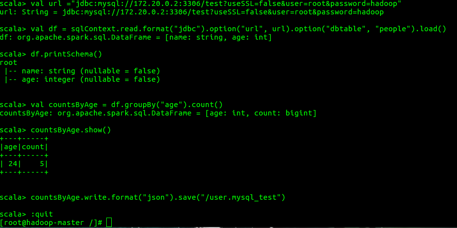
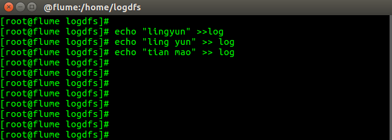
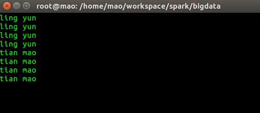

# 基于Docker的大数据开发测试环境搭建及使用说明
## 1.基本软件环境介绍

### 1.1 软件版本

- 操作系统: CentOS 6
- Java环境: OpenJDK 8
- 基于docker-compose管理镜像和容器，并进行集群的编排


| 工具 | 介绍 |
| --- | --- |
| flume | Flume是Cloudera提供的一个高可用的，高可靠的，分布式的海量日志采集、聚合和传输的系统，Flume支持在日志系统中定制各类数据发送方，用于收集数据；同时，Flume提供对数据进行简单处理，并写到各种数据接受方（可定制）的能力。 |
| kafka | Kafka是由Apache软件基金会开发的一个开源流处理平台，由Scala和Java编写。Kafka是一种高吞吐量的分布式发布订阅消息系统，它可以处理消费者规模的网站中的所有动作流数据。  |
| zookeeper | ZooKeeper 是一个开源的分布式协调服务，由雅虎创建，是 Google Chubby 的开源实现。 分布式应用程序可以基于 ZooKeeper 实现诸如数据发布/订阅、负载均衡、命名服务、分布式协 调/通知、集群管理、Master 选举、配置维护，名字服务、分布式同步、分布式锁和分布式队列 等功能。|
| hadoop | Hadoop是一个由Apache基金会所开发的分布式系统基础架构。 |
| spark | Apache Spark 是专为大规模数据处理而设计的快速通用的计算引擎。Spark是UC Berkeley AMP lab (加州大学伯克利分校的AMP实验室)所开源的类Hadoop MapReduce的通用并行框架，Spark，拥有Hadoop MapReduce所具有的优点；但不同于MapReduce的是——Job中间输出结果可以保存在内存中，从而不再需要读写HDFS，因此Spark能更好地适用于数据挖掘与机器学习等需要迭代的MapReduce的算法。|
| hive | hive是基于Hadoop的一个数据仓库工具，可以将结构化的数据文件映射为一张数据库表，并提供简单的sql查询功能，可以将sql语句转换为MapReduce任务进行运行。 其优点是学习成本低，可以通过类SQL语句快速实现简单的MapReduce统计，不必开发专门的MapReduce应用，十分适合数据仓库的统计分析。 |
| hbase | HBase是一个分布式的、面向列的开源数据库，HBase不同于一般的关系数据库，它是一个适合于非结构化数据存储的数据库。另一个不同的是HBase基于列的而不是基于行的模式。|
| yarn | Apache Hadoop YARN （Yet Another Resource Negotiator，另一种资源协调者）是一种新的 Hadoop 资源管理器，它是一个通用资源管理系统，可为上层应用提供统一的资源管理和调度，它的引入为集群在利用率、资源统一管理和数据共享等方面带来了巨大好处。|

### 1.2 镜像依赖关系


上图中，灰色的镜像（centos:6）为docker hub官方基础镜像。其它镜像（twinsen/hadoop:2.7.2等）都是在下层镜像的基础上实现的。这一镜像之间的依赖关系，决定了镜像的编译顺序.

## 2.使用方法简介

### 2.1 安装docker
具体安装方法请自行百度，安装完成后，在命令行下输入docker info进行测试，输出结果如下图所示，说明安装成功


### 2.2 构建镜像
首先，下载工程文件（ https://github.com/ruoyu-chen/hadoop-docker/archive/1.1.zip ），解压到任意目录下。
接下来，可以在工程根目录下（包含有docker-compose-build-all.yml文件），在系统命令行中，依次使用下列命令构建镜像：
	
- 拉取MySQL 5.7 官方镜像

`docker pull mysql:5.7`

- 拉取CentOS 6 官方镜像

`docker pull centos:6`

- 拉取基本操作系统和OpenJDK环境，包含CentOS 6和OpenJDK 8
    
`docker pull twinsen/os-jvm:centos6-openjdk8`

- 拉取Hadoop环境，包含Hadoop 2.7.2

`docker pull twinsen/hadoop:2.7.2`

- 拉取Hive环境，包含Hive 2.1.1

`docker pull twinsen/hive:2.1.1`

- 拉取Spark环境，包含Spark 2.1.0

`docker pull twinsen/spark:2.1.0`

### 2.3 环境准备
完成上一步的镜像编译工作后，在系统命令行中，可以使用docker images命令查看目前docker环境下的镜像，如下图所示：

为了方便使用，在工程根目录下放置了一个docker-compose.yml文件，这一文件中已经预先配置好了由3个slave节点和1个master节点组成的Spark集群。

在使用集群之前，需要先完成初始化

<pre><code>
#[创建容器]
docker-compose up -d
#[格式化HDFS。第一次启动集群前，需要先格式化HDFS；以后每次启动集群时，都不需要再次格式化HDFS]
docker-compose exec spark-master hdfs namenode -format
#[初始化Hive数据库。仅在第一次启动集群前执行一次]
docker-compose exec spark-master schematool -dbType mysql -initSchema
#[将Spark相关的jar文件打包，存储在/code目录下，命名为spark-libs.jar]
docker-compose exec spark-master jar cv0f /code/spark-libs.jar -C /root/spark/jars/ .
#[启动HDFS]
docker-compose exec spark-master start-dfs.sh
#[在HDFS中创建/user/spark/share/lib/目录]
docker-compose exec spark-master hadoop fs -mkdir -p /user/spark/share/lib/
#[将/code/spark-libs.jar文件上传至HDFS下的/user/spark/share/lib/目录下]
docker-compose exec spark-master hadoop fs -put /code/spark-libs.jar /user/spark/share/lib/
#[关闭HDFS]
docker-compose exec spark-master stop-dfs.sh
</code></pre>

### 2.4 启动及停止集群

下面简要介绍启动和关闭Spark集群的步骤（以下步骤均在命令行环境下完成，在工程根目录下执行）
- 启动集群进程，依次执行：

<pre><code>
#[启动HDFS]
docker-compose exec spark-master start-dfs.sh
#[启动YARN]
docker-compose exec spark-master start-yarn.sh
#[启动Spark]
docker-compose exec spark-master start-all.sh
</code></pre>

- 停止Spark集群，依次执行：

<pre><code>
#[停止Spark]
docker-compose exec spark-master stop-all.sh
#[停止YARN]
docker-compose exec spark-master stop-yarn.sh
#[停止HDFS]
docker-compose exec spark-master stop-dfs.sh
#[停止容器]
docker-compose down</code></pre>


### 2.5 开发与测试过程中的集群使用方法

目前集群中采用的是1个master节点和3个slave节点的分配方案，可以通过调整docker-compose配置文件以及相应软件的配置文件来实现集群扩容，暂时无法做到自动化扩容。

编写程序可以使用任意的IDE和操作系统，程序编写完成后，打包为jar文件，然后放在工程根目录下的./volume/code/目录下。任何一个集群环境下，都会在集群启动时将code目录挂载在master节点的/code路径下。

如果要执行wordcount程序（在volume/code/tests/mapreduce-test目录下已经包含了）。在启动集群并启动各服务进程后。执行下列语句，可以进入master节点的命令行环境：

<pre><code>docker-compose exec spark-master /bin/bash
</code></pre>

然后可以进入/code目录提交任务，完成计算。如下图所示：

## 3.Docker相关
- `docker ps -a`(查看所有的容器,包括已经停止的)
- 重启:首先将容器启动起来,然后依次执行上面的脚本,`docker-compose exec spark-master /bin/bash`进入shell.
- 查看挂载信息:`docker inspect spark-master | grep volume`

## 4.集群相关
### (1) HDFS上传下载文件
- 上传:`hdfs dfs -put /code.yun.csv /user`
- 下载:`hdfs dfs -get /user/yun.csv /code`
- 查看:`dfs dfs -ls /user`

### (2) 在web ui中查看文件
 

### (3)spark web ui
 

### (4)yarn web ui
 


### (5)使用idea打包spark
- 首先需要注意的是jdk的版本一定要和这里的1.8.0对应
- 使用maven构建项目,[pom.xml文件](./pom.xml) 
- 求最大值:
```
package yun.mao

/**
  * @Classname MaxPrice
  * @Description TODO
  * @Date 19-3-18 下午2:34
  * @Created by mao<tianmao818@qq.com>
  */
import org.apache.spark.SparkContext._
import org.apache.spark.{SparkConf,SparkContext}
object MaxPrice {
  def main(args: Array[String]){
    val conf = new SparkConf().setAppName("Max Price")
    val sc = new SparkContext(conf)

    sc.textFile(args(0))
      .map(_.split(","))
      .map(rec => ((rec(0).split("-"))(0).toInt, rec(1).toFloat))
      .reduceByKey((a,b) => Math.max(a,b))
      .saveAsTextFile(args(1))
  }
}
```

### (6)使用spark-submit提交到集群
```
spark-submit --class yun.mao.MaxPrice	--master yarn	--deploy-mode cluster	yunmao.jar	hdfs://hadoop-master:54310/user/yun.csv	hdfs://hadoop-master:54310/user/mao.txt
```

### (7)hive的使用(使用mysql作为metadata)

### (8)hbase的使用

### (9)spark shell统计行数
```
val lines = sc.textFile("data.txt")
val lineLengths = lines.map(s => s.length)
val totalLength = lineLengths.reduce((a, b) => a + b)
```
### (10)使用mysql数据库
- 进入mysql容器:`docker exec -it mysql容器ID /bin/bash  `

```
# 在配置文件中查看mysql配置信息
  mysql:
    image: mysql:5.7
    volumes:
      - "./volume/mysql:/var/lib/mysql"
    container_name: mysql
    hostname: mysql
    networks:
      - spark
    environment:
      - MYSQL_ROOT_PASSWORD=hadoop
    tty: true

CREATE TABLE `people` (
  `name` varchar(150) NOT NULL,
  `user_id` int(11) NOT NULL,
  PRIMARY KEY  (`age`)
) ENGINE=InnoDB DEFAULT CHARSET=utf8;

INSERT INTO `people` VALUES("mao",24);
INSERT INTO `people` VALUES("yun",24);

```
- spark连接数据库
```
val sqlContext=new org.apache.spark.sql.SQLContext(sc)
// Creates a DataFrame based on a table named "people"
// stored in a MySQL database.
//首先使用docker inspect查看容器的ip
// 使用useSSL=false,其他参数分割使用&符号
val url ="jdbc:mysql://172.20.0.2:3306/test?useSSL=false&user=root&password=hadoop"
val df = sqlContext.read.format("jdbc").option("url", url).option("dbtable", "people").load()

// Looks the schema of this DataFrame.
df.printSchema()

// Counts people by age
val countsByAge = df.groupBy("age").count()
countsByAge.show()

// Saves countsByAge to S3 in the JSON format.
countsByAge.write.format("json").save("s3a://...")
```
 
### (11)机器学习的第一个例子
```
 val sqlContext=new org.apache.spark.sql.SQLContext(sc)
 import sqlContext.implicits._
 val df = Seq(
  (1,5),
  (1,6),
  (1,7),
  (1,8),
  (0,1),
  (0,2),
  (0,3),
  (0,4)
).toDF("label", "features")
import org.apache.spark.ml.classification.LogisticRegression
val model = lr.fit(df)
val weights = model.weights
model.transform(df).show()
```
### (12)logistic regression完整案例[戳这里](./logistic-regression.md) 


## 5.完整的pipeline
### (1)zookeeper+flume+kafka
- flume的监控方式
```
# 监控一个文件,导向kafka中
agent.sources=s1
agent.sinks=k1
agent.channels=c1

agent.sources.s1.type=exec
agent.sources.s1.command = tail -f /home/logdfs/log
agent.sources.s1.channels=c1
agent.sources.s1.shell = /bin/sh -c


agent.channels.c1.type=memory
agent.channels.c1.capacity=10000
agent.channels.c1.transactionCapacity=100

agent.sinks.k1.type=org.apache.flume.sink.kafka.KafkaSink
agent.sinks.k1.brokerList=kafka2:9093
agent.sinks.k1.topic=test0
agent.sinks.k1.serializer.class=kafka.serializer.StringEncoder

agent.sinks.k1.channel=c1


# 其他方式

agent.sources.s1.type = netcat 
agent.sources.s1.bind = localhost 
agent.sources.s1.port = 5678
agent.sources.s1.channels = c1 

agent.sinks.sk1.type = logger 
agent.sinks.sk1.channel = c1 


agent.channels.c1.type = memory
agent.channels.c1.capacity = 1000 
agent.channels.c1.transactionCapacity = 100


agent.sources.s1.type = spooldir 
agent.sources.s1.spoolDir =/var/log
agent.sources.s1.fileHeader = true 
agent.sources.s1.channels = c1 
agent.sinks.sk1.type = logger 
agent.sinks.sk1.channel = c1
agent.channels.c1.type = memory 
agent.channels.c1.capacity = 10004 
agent.channels.c1.transactionCapacity = 100

```
- zookeeper相关的配置
```
clientPort=2181
dataDir=/data
dataLogDir=/datalog
tickTime=2000
initLimit=5
syncLimit=2
autopurge.snapRetainCount=3
autopurge.purgeInterval=0
maxClientCnxns=60
server.1=zoo1:2888:3888
server.2=zoo2:2888:3888
server.3=zoo3:2888:3888
```


- 测试kafka(kafka依赖与zookeeper,在docker-compose文件中已经进行了配置,必须在zookeeper服务启动起来的时候kafka才能够被启动起来)
```
# 创建topic
kafka-topics.sh --create --zookeeper zoo1:2181, zoo2:2181, zoo3:2181 --replication-factor 3 --partitions 3 --topic test
# 查看topic
kafka-topics.sh --describe --zookeeper zoo1:2181, zoo2:2181, zoo3:2181 --topic test
# 创建生产者
kafka-console-producer.sh --broker-list kafka1:9092 -topic test
# 创建消费者
kafka-console-consumer.sh --bootstrap-server kafka1:9092,kafka2:9092,kafka3:9092 --topic test --from-beginning
```

### (2)kafka+spark streaming
- 导入相关的jars:`spark-shell --jars`
```
# 注意jar之间需要使用逗号进行分割
spark-shell --jars spark-streaming-kafka-0-10_2.11-2.3.0.jar,kafka_2.12-2.1.1.jar,kafka-clients-2.1.1.jar 
```

- spark-shell脚本
```
# 导入包
import org.apache.spark.streaming.kafka010.KafkaUtils
import org.apache.kafka.common.serialization.StringDeserializer
import org.apache.spark.SparkConf
import org.apache.spark.streaming.{Seconds, StreamingContext}
import org.apache.spark.streaming.kafka010.LocationStrategies.PreferConsistent
import org.apache.spark.streaming.kafka010.ConsumerStrategies.Subscribe
import org.apache.spark.mllib.classification.SVMModel
import org.apache.spark.mllib.linalg.Vectors
import org.apache.spark.sql.SparkSession

# 配置
val kafkaParams = Map[String, Object]("bootstrap.servers" -> "kafka1:9092","key.deserializer" -> classOf[StringDeserializer],"value.deserializer" -> classOf[StringDeserializer],"auto.offset.reset" -> "latest","group.id" -> "group_1","enable.auto.commit" -> (false: java.lang.Boolean))
val streamingContext = new StreamingContext(sc, Seconds(1))
val topics = Array("test0")
# 接受消息
val kafkaStream = KafkaUtils.createDirectStream[String, String](streamingContext,PreferConsistent,Subscribe[String, String](topics, kafkaParams))
# 分词
val words = kafkaStream.transform { rdd =>rdd.flatMap(record => (record.value().toString.split(" ")))}
# 打印
words.print()
# 启动
streamingContext.start() 
# 关闭
streamingContext.awaitTermination()
```
- 执行结果(flume监控log文件,log文件增加一行触发,flume将增加的行输入到kafka,spark从kafka订阅了topic接收消息,spark streaming自动对接收到的行进行分词并打印)
 

 

### (3)kafka消息订阅测试软件(Linux)


