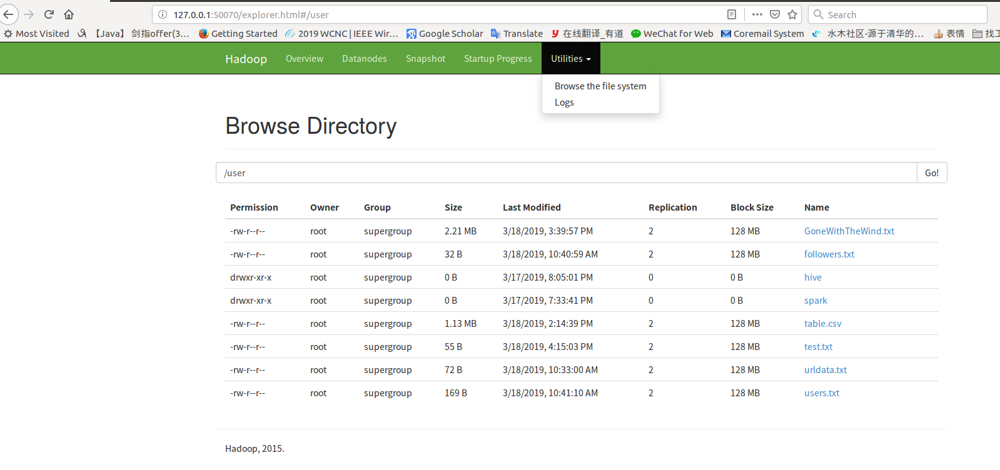
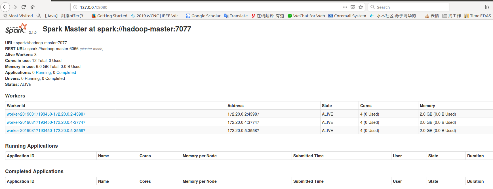
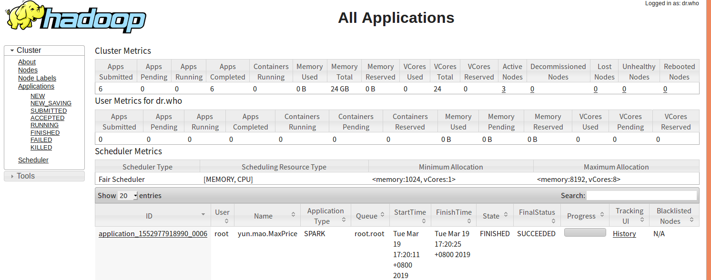

#基于Docker的Hadoop开发测试环境使用说明
## 1.基本软件环境介绍

### 1.1 软件版本

- 操作系统: CentOS 6
- Java环境: OpenJDK 8
- Hadoop: 2.7.2
- Spark: 2.1.0
- Hive: 2.1.1
- HBase: 1.2.2
- Zookeeper: 3.4.8
- 基于docker-compose管理镜像和容器，并进行集群的编排
- 所有软件的二进制包均通过网络下载。其中包含自行编译的Hadoop和Protobuf二进制包，保存在Github上，其它软件的二进制包均使用Apache官方镜像。


### 1.2 镜像依赖关系


上图中，灰色的镜像（centos:6）为docker hub官方基础镜像。其它镜像（twinsen/hadoop:2.7.2等）都是在下层镜像的基础上实现的。这一镜像之间的依赖关系，决定了镜像的编译顺序.

## 2.使用方法简介

### 2.1 安装docker
具体安装方法请自行百度，安装完成后，在命令行下输入docker info进行测试，输出结果如下图所示，说明安装成功


### 2.2 构建镜像
首先，下载工程文件（ https://github.com/ruoyu-chen/hadoop-docker/archive/1.1.zip ），解压到任意目录下。
接下来，可以在工程根目录下（包含有docker-compose-build-all.yml文件），在系统命令行中，依次使用下列命令构建镜像：
	
- 拉取MySQL 5.7 官方镜像

`docker pull mysql:5.7`

- 拉取CentOS 6 官方镜像

`docker pull centos:6`

- 拉取基本操作系统和OpenJDK环境，包含CentOS 6和OpenJDK 8
    
`docker pull twinsen/os-jvm:centos6-openjdk8`

- 拉取Hadoop环境，包含Hadoop 2.7.2

`docker pull twinsen/hadoop:2.7.2`

- 拉取Hive环境，包含Hive 2.1.1

`docker pull twinsen/hive:2.1.1`

- 拉取Spark环境，包含Spark 2.1.0

`docker pull twinsen/spark:2.1.0`

### 2.3 环境准备
完成上一步的镜像编译工作后，在系统命令行中，可以使用docker images命令查看目前docker环境下的镜像，如下图所示：

为了方便使用，在工程根目录下放置了一个docker-compose.yml文件，这一文件中已经预先配置好了由3个slave节点和1个master节点组成的Spark集群。

在使用集群之前，需要先完成初始化

<pre><code>
#[创建容器]
docker-compose up -d
#[格式化HDFS。第一次启动集群前，需要先格式化HDFS；以后每次启动集群时，都不需要再次格式化HDFS]
docker-compose exec spark-master hdfs namenode -format
#[初始化Hive数据库。仅在第一次启动集群前执行一次]
docker-compose exec spark-master schematool -dbType mysql -initSchema
#[将Spark相关的jar文件打包，存储在/code目录下，命名为spark-libs.jar]
docker-compose exec spark-master jar cv0f /code/spark-libs.jar -C /root/spark/jars/ .
#[启动HDFS]
docker-compose exec spark-master start-dfs.sh
#[在HDFS中创建/user/spark/share/lib/目录]
docker-compose exec spark-master hadoop fs -mkdir -p /user/spark/share/lib/
#[将/code/spark-libs.jar文件上传至HDFS下的/user/spark/share/lib/目录下]
docker-compose exec spark-master hadoop fs -put /code/spark-libs.jar /user/spark/share/lib/
#[关闭HDFS]
docker-compose exec spark-master stop-dfs.sh
</code></pre>

### 2.4 启动及停止集群

下面简要介绍启动和关闭Spark集群的步骤（以下步骤均在命令行环境下完成，在工程根目录下执行）
- 启动集群进程，依次执行：

<pre><code>
#[启动HDFS]
docker-compose exec spark-master start-dfs.sh
#[启动YARN]
docker-compose exec spark-master start-yarn.sh
#[启动Spark]
docker-compose exec spark-master start-all.sh
</code></pre>

- 停止Spark集群，依次执行：

<pre><code>
#[停止Spark]
docker-compose exec spark-master stop-all.sh
#[停止YARN]
docker-compose exec spark-master stop-yarn.sh
#[停止HDFS]
docker-compose exec spark-master stop-dfs.sh
#[停止容器]
docker-compose down</code></pre>


### 2.5 开发与测试过程中的集群使用方法

目前集群中采用的是1个master节点和3个slave节点的分配方案，可以通过调整docker-compose配置文件以及相应软件的配置文件来实现集群扩容，暂时无法做到自动化扩容。

编写程序可以使用任意的IDE和操作系统，程序编写完成后，打包为jar文件，然后放在工程根目录下的./volume/code/目录下。任何一个集群环境下，都会在集群启动时将code目录挂载在master节点的/code路径下。

如果要执行wordcount程序（在volume/code/tests/mapreduce-test目录下已经包含了）。在启动集群并启动各服务进程后。执行下列语句，可以进入master节点的命令行环境：

<pre><code>docker-compose exec spark-master /bin/bash
</code></pre>

然后可以进入/code目录提交任务，完成计算。如下图所示：

## 3.Docker相关
- `docker ps -a`(查看所有的容器,包括已经停止的)
- 重启:首先将容器启动起来,然后依次执行上面的脚本,`docker-compose exec spark-master /bin/bash`进入shell.
- 查看挂载信息:`docker inspect spark-master | grep volume`

## 4.集群相关
### (1) HDFS上传下载文件
- 上传:`hdfs dfs -put /code.yun.csv /user`
- 下载:`hdfs dfs -get /user/yun.csv /code`
- 查看:`dfs dfs -ls /user`

### (2) 在web ui中查看文件
 

### (3)spark web ui
 

### (4)yarn web ui
 


### (5)使用idea打包spark
- 首先需要注意的是jdk的版本一定要和这里的1.8.0对应
- 使用maven构建项目,[pom.xml文件](./pom.xml) 
- 求最大值:
```
package yun.mao

/**
  * @Classname MaxPrice
  * @Description TODO
  * @Date 19-3-18 下午2:34
  * @Created by mao<tianmao818@qq.com>
  */
import org.apache.spark.SparkContext._
import org.apache.spark.{SparkConf,SparkContext}
object MaxPrice {
  def main(args: Array[String]){
    val conf = new SparkConf().setAppName("Max Price")
    val sc = new SparkContext(conf)

    sc.textFile(args(0))
      .map(_.split(","))
      .map(rec => ((rec(0).split("-"))(0).toInt, rec(1).toFloat))
      .reduceByKey((a,b) => Math.max(a,b))
      .saveAsTextFile(args(1))
  }
}
```

### (6)使用spark-submit提交到集群
```
spark-submit --class yun.mao.MaxPrice	--master yarn	--deploy-mode cluster	yunmao.jar	hdfs://hadoop-master:54310/user/yun.csv	hdfs://hadoop-master:54310/user/mao.txt
```

### (7)hive的使用(使用mysql作为metadata)

### (8)hbase的使用


